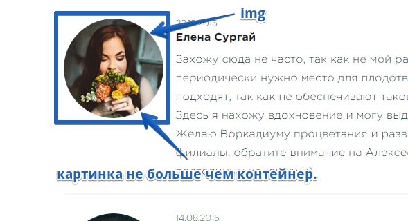
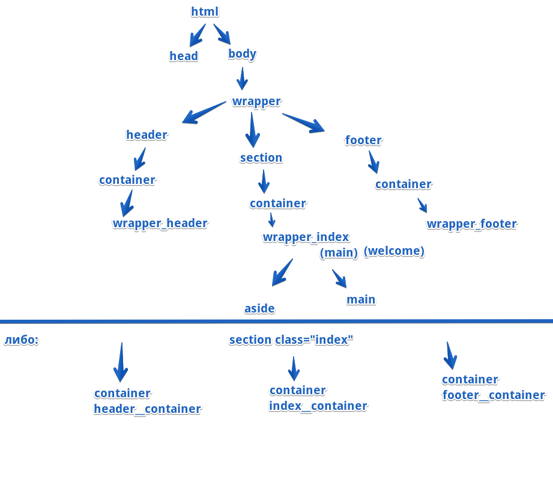
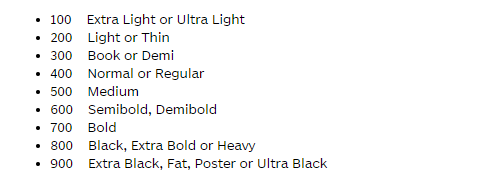

# alex_advices

## img

* заружать изображения размером с контейнер   

    

* для поддержки и чтобы картинка не искажалась в  ie картинки вставлять bg и потом в этот же элемент вставлять img, но img мы скрываем.   

## ссылка   

* если логотип, то прописывать href='/' (ведет в корень и ищет там файл с index) 

## layout  

## Работа с дизайнером  

* требовать шрифты

## Шрифты

* не зыбыть подключить символы кириллицы
* подключать запасные шрифты
* таблица font-weight   

* подключать сглаживание шрифтов    
  -webkit-font-smoothing: antialiased;   
  -moz-osx-font-smoothing: grayscale;   

## Лендинг
* ставить min-height по макету(для каждого макета по ширинам laptop mobile tablet и т д ), чтобы если уменьштся viewport то секция сжиматься не будет при viewport меньше 650px    
* для того чтобы background не урезался во время уменьшения viewport можно для каждого разрешения вырезать свой отдельный background    

## SVG   
* Как отображается svg в браузере.
  1. создается холст размером с viewbox 
  2. на нем рисуется элемент (типо path circle и т.д.)
  3. весь viewbox растягивается по svg элементу (viewport)   
 
 ## Формы
* убираем реальную кнопку только через left:-9999px , потому что может появиться скрол по потоку если ставить обратное значение

## Pixel Perfect   
* для адаптивной верстки и вообще когда элемент плавает по старнице в зависимости от viewport, то подгоняем под PP только не плавающие элементы страницы.    
* если сайт резиновый то 1) подгоняем ширину viewport под макет(который в psd) 2) и под такой размер ставим проценты для измерений.

## Fiewfox    
* для flexitems ставить margin в px или в vh
